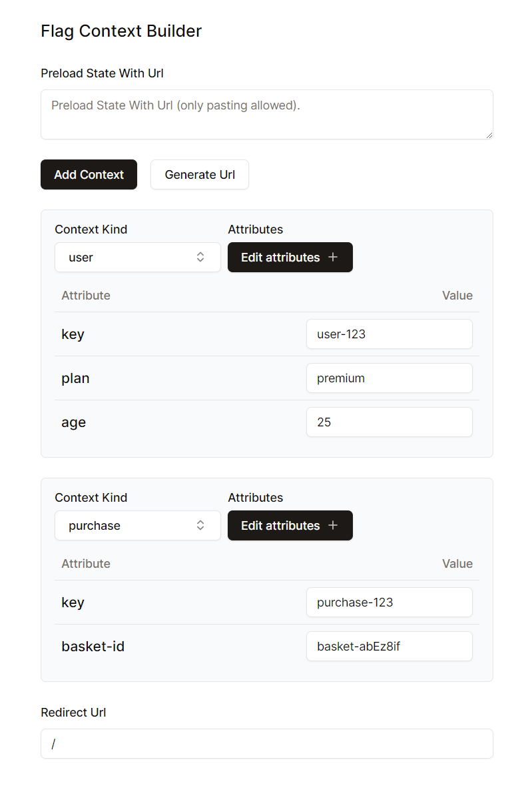
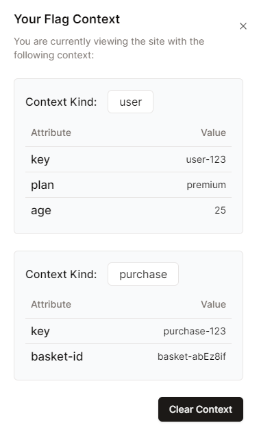

# Flaggy

Flaggy provides easy to use tools that help with managing feature flag context. We aim to support multiple SASS flag providers but currently supported providers LaunchDarkly. More to come.



Generates you with a link like this:

```link
https://flaggy-six.vercel.app/api/flag/context?data={"contexts":[{"kind":"user","attributes":{"key":"user-123","plan":"premium","age":"25"}},{"kind":"purchase","attributes":{"key":"purchase-123","basket-id":"basket-abEz8if"}}]}&redirectUrl=https://flaggy-six.vercel.app/
```

Using the link will persist the context you setup up on the site, meaning that if you navigate away or refresh the page, your original context will still be in place. By default this is set to 1 hour upon use, but you can clear this via the UI.

Every flag evaluation that is made to Launchdarkly either on the server or client will be given this context.

You can also use a previously generated link to quickly get back the context you setup in the Context Builder the builder saving you time.



## Getting Started

These instructions will get you a copy of the project up and running on your local machine.

### Prerequisites

- Node.js
- npm

### Cloning the Repository

To clone the repository, run the following command in your terminal:

```sh
git clone https://github.com/Nhollas/Flaggy.git
```

## Setting Up The Project

1. Navigate to the project directory:

```bash
cd Flaggy
```

2. Install Dependencies:

```bash
npm install
```

3. Setup environment variables:

**copy the `.env.example` file to a new file called `.env.local`.**

```bash
copy .env.example .env.local
```

Replace the Launchdarkly values, they can be found under your specific project here:

https://app.launchdarkly.com/settings/projects

## Run Development Server

Finally, run the development server:

```bash
npm run dev
```

Now you can open [http://localhost:3000](http://localhost:3000) with your browser to see the application.
